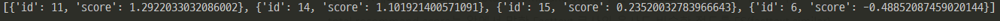
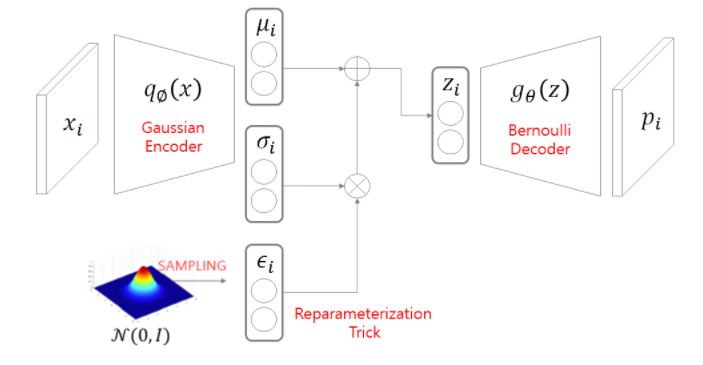
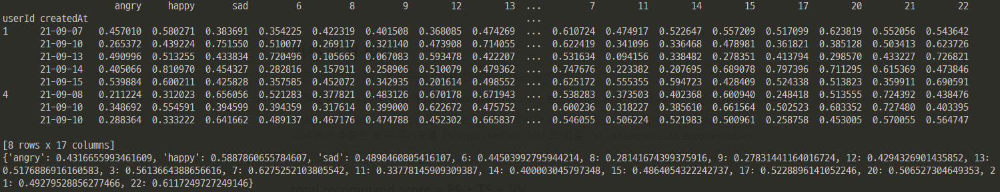

## 커넥티 추천 방식

content-based 기반 추천 시스템인 **LDA** 와 **FASTTEXT**를 통한 코사인 유사도 및 collaborative 기반 추천시스템인 **VAE**의 결과값을 통해 사용자에게 다이어리를 추천한다. 


## 토픽 모델링 및 데이터 분류

수집된 모든 일기 데이터를 바탕으로 해당 문서에 대한 주제를 예측하고 분류한다. 해당 문서에 대한 주제 분류에는 기계학습을 (LDA)통한 문서의 토픽 예측 정보를 반영하여 문서 분류를 수행한다.


#### LDA 토픽

LDA는 학습된 문서 내의 단어 빈도수 통계를 기반으로 해당 문서에 지정된 복수의 토픽을 예측한다. 
예를 들어 아래와 같은 토픽 목록을 LDA가 학습을 통해 도출했다고 가정한다.

```python
(0, '0.015*"drive" + 0.014*"thanks" + 0.012*"card" + 0.012*"system"')
(1, '0.009*"back" + 0.009*"like" + 0.009*"time" + 0.008*"went"')
(2, '0.012*"colorado" + 0.010*"david" + 0.006*"decenso" + 0.005*"tyre"')
(3, '0.020*"number" + 0.018*"wire" + 0.013*"bits" + 0.013*"filename"')
(4, '0.038*"space" + 0.013*"nasa" + 0.011*"research" + 0.010*"medical"')
(5, '0.014*"price" + 0.010*"sale" + 0.009*"good" + 0.008*"shipping"')
(6, '0.012*"available" + 0.009*"file" + 0.009*"information" + 0.008*"version"')
(7, '0.021*"would" + 0.013*"think" + 0.012*"people" + 0.011*"like"')

```

각 토픽은 위와 같이 각 단어에 따라 해당 문서의 토픽 분류에 기여하고 있는 수치를 나타내고 있다. 다음과 같이 정의된 모델에서 특정 문서를 입력 값으로 넣었을 경우, 아래와 같은 분석 결과를 확인할 수 있다.

```python
해당 문서의 topic 비율은 [
(7, 0.3050222), (9, 0.5070568), (1, 0.1319604), (2, 0.042834017)
]
```


## 토픽 선정

단, 해당 알고리즘은 문서 내의 단어의 빈도 수에 따라 토픽을 결정하기 때문에 학습되지 못한 단어나 매우 복잡한 토픽을 다루는 문서에 대하여 성능이 떨어지는 단점이 존재한다. 

따라서 해당 문서의 제목에는 보편적으로 특정 토픽을 가리키는 단어가 포함되어 있는 토픽을 선정하거나 해당 문서에서 주된 토픽을 형성하게 된 단어를 토픽을 설정한다.


## 사용자 관심분야 분석

**CONNECTEE**는 사용자가 서비스 내에서 수행한 액션을 수집하여, 사용자의 관심 분야를 측정한다. 사용자에게서 수집되는 데이터 중, 관심 분야 측정에 기여하는 항목은 다음과 같다.

- 사용자는 어떤 일기에 접근하였는가
- 사용자는 어떤 일기에 감정표현 기능을 수행했는가

위의 정보를 바탕으로 사용자의 관심 분야를 측정하며, 이는 추천 뉴스피드에서 사용자에게 제시할 문서를 선별하는 데에 사용된다.
사용자는 자신의 BOW(bag of Word)가방을 들고 다니며 최대 5가지 토픽을 가질 수 있다. 사용자가 일기를 클릭하였다면 해당 문서에서 주된 토픽을 사용자의 가방에 넣는다.
사용자가 어떤 다이어리에 **감정표현**을 표현하였다면 해당 다이어리의 토픽을 사용자의 가방에 2개의 토픽을 넣게 된다.
따라서 사용자는 자신의 관심사 단어 5개 주머니 및 해당 관심사 단어백터들의 평균을 가지고 있게 되고 이를 기반으로 
사용자에게 추천할 벡터 유사도를 측정한다.


## Fasttext 유사도 측정

앞의 방식만으로도 충분히 유사도를 통한 추천을 할 수 있다. 하지만 사용자가 만약 모르는 단어들로만 이루어진 다이어리를 제출한 경우 해당 다이어리에서 토픽을 추출 할 수 없을 뿐더러 그것을 방지 하기 위해서 사용자에게 입력이 들어올때마다 모델을 학습하는 거는 리소스 낭비다.
FastText의 인공 신경망을 학습한 후에는 데이터 셋의 모든 단어의 각 n-gram에 대해서 워드 임베딩이 된다. 이렇게 되면 장점은 데이터 셋만 충분한다면 위와 같은 내부 단어(Subword)를 통해 모르는 단어(Out Of Vocabulary, OOV)에 대해서도 대비할 수 있다.
하지만  fasttext는 단어(토큰)를 임베딩하는 기법이고 문장을 바로 벡터로 바꿀수는 없다. 문장을 벡터화하는 방법에는 doc2vec 같은 기법이 있고 Document-Term Matrix에 SVD 같은 차원 축소 기법을 이용하는 방법도 있다. 다만 fasttext 같은 단어 임베딩 기법으로 단어 벡터를 추출한 뒤, 문장이 주어지면 문장에 포함된 토큰들의 벡터들을 평균을 취해 이를 문장의 representation으로 삼는 방법이 존재하여 토큰 벡터의 평균 벡터를 문장 임베딩으로 사용한다.

#### 구현 예제

FT 모델과 LDA 모델에서 코사인 유사도 결과값을 다이어리 id별로 묶고 값이 높은 순으로 정렬하여 백앤드 에게 전달한다.
VAE_recommand 는 뒤에서 자세히 다루고 결과값은 다음과 같다.

```python
def recommand_diary(user_id):
    FT_recommand = Fasttext.recommand(user_id)
    LDA_recommand = LDA.recommand(user_id)
    # VAE_recommand = defaultdict(int,VAE.recommand(user_id))
    result = []
    for i in range(len(FT_recommand)):
        temp = {}
        temp['id'] = FT_recommand[i]['id']
        temp['score'] = FT_recommand[i]['similar']+LDA_recommand[i]['similar']
            # +VAE_recommand[temp['id']]
        result.append(temp)
    result.sort(key=lambda x: x['score'], reverse=True)
    temp = [i['id'] for i in result]
    return temp
```




## **VAE 를 이용한 감정 기반 추천 시스템**



Variational AutoEncoder는 축소된 차원으로 Z를 샘플링하여 Z를 정규 분포에 가깝게 만드는 방식의 모델이다.  복원된 AutoEncoder에서 복원된 Matrix를 활용하여 추천시스템으로 활용가능하다. 

Latent Space가 정규 분포에 가깝기 때문에 유용한 Space값을 얻을 수 있어 AE보다 우수한 성능을 가져와 사용하였다.

#### 구현 예제



화면에서 보이는 것처럼 사용자가 클릭, 감정 표현한 다이어리에 대한 값을 해당 날짜에 가진 감정을 기준으로 나누어 각 다이어리의 값을 넣고 VAE의 결과값을 나타내고 있다. 만약 1번 유저에 대한 추천시스템이면 1번 행 값 중에서 다이어리 값만 가져와 추천 시스템에 사용한다. 

## 최종 추천 방식

최근에 작성된 다이어리 중에 X개를 선정한다. (X는 파라미터)

선정한 X개의 다이어리중에 total recommand score가 높은순으로 사용자에게 제시한다.

total recommand score는 앞에서 말한 Fasttext 코사인 유사도 비슷한 정도를 FS(fasttext similar) ,LDA에서 추출한 토픽 유사도를 TS(Topic slimilar) , VAE 의 값을 VV( variational auto encoder value) 라고 했을 때

### total recommand score = FS + TS\+ VV

로 구할 수 있다.


